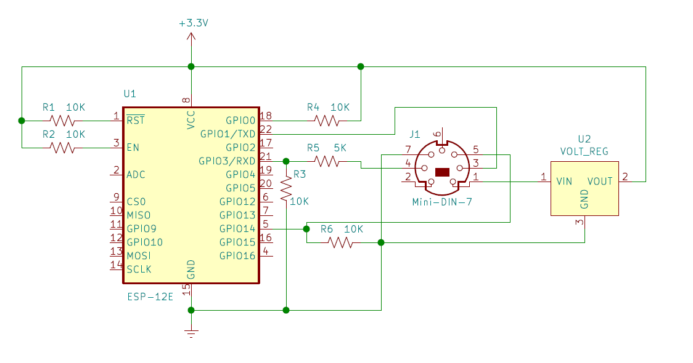

# esp-roomba-mqtt

ESP8266 MQTT Roomba controller (Useful for hooking up old Roombas to Home Assistant)

## Parts:
* [ESP12E](http://www.ebay.com/itm/121951859776) ESP8266 Wifi microcontroller ($3-4) Though any ESP module will probably work
* [Small 3.3V switching step-down regulator](https://www.amazon.com/gp/product/B01MQGMOKI) ($1-2)
* 5kOhm & 10kOhm resistor for 5V->3.3V voltage divider (any two resistors above a few kOhm with a 1:2 ratio should work)
* Some ~10kOhm pullup/pulldown resistors to get the ESP12E in the right modes for programming (probably anything 2k-20kOhm will work fine)
* 3.3V FTDI cable for initial programming
* Some wire you can jam into the Roomba's Mini Din connector, or a proper Mini Din connector

## Electronics



### Connections

* ESP GPIO15 -> 10kOhm Resistor -> GND
* ESP GPIO0 -> 10kOhm Resistor -> 3.3V
* ESP EN -> 10kOhm Resistor -> 3.3V
* ESP TX -> Roomba RX (Pin3 on Roomba's Mini Din connector)
* Roomba TX (Pin4 on Roomba) -> 5kOhm -> ESP RX -> 10kOhm -> GND
* ESP GPIO14 -> Roomba BRC (Pin5 on Roomba)
* ESP 3.3V -> Voltage regulator 3.3V
* ESP GND -> Voltage regulator GND
* Voltage regulator Vin -> Roomba Vpwr (Pin 1 or 2 on Roomba)
* Voltage regulator GND -> Roomba GND (Pin 6 or 7 on Roomba)

### Voltage divider

Note that I used a voltage divider from the Roomba TX pin to the ESP12E RX pin since the Roomba serial is 5V and the ESP is 3.3V. I used a 5kOhm resistor and a 10kOhm resistor but anything above a few kOhm with a 1:2 ratio should be fine.

## Compiling the code

### Setting some in-code config values

First off you'll need to create a `src/secrets.h`. This file is `.gitignore`'d so you don't put your passwords on Github.

    cp src/secrets.example.h src/secrets.h

Then edit your `src/secrets.h` file to reflect your wifi ssid/password and MQTT server password (if you're using the Home Assistant built-in broker, this is just your API password).

You may also need to modify the values in `src/config.h` (particularly `MQTT_SERVER`) to match your setup.

### Building and uploading

The easiest way to build and upload the code is with the [PlatformIO IDE](http://platformio.org/platformio-ide).

The first time you program your board you'll want to do it over USB/Serial. After that, programming can be done over wifi (via ArduinoOTA). To program over USB/Serial, change the `upload_port` in the `platformio.ini` file to point to the appropriate device for your board. Probably something like the following will work if you're on a Mac.

    upload_port = /dev/tty.cu*

If you're not using an ESP12E board, you'll also want to update the `board` line with your board. See [here](http://docs.platformio.org/en/latest/platforms/espressif8266.html) for other PlatformIO supported ESP8266 board. For example, for the Wemos D1 Mini:

    board = d1_mini

After that, from the PlatformIO Atom IDE, you should be able to go to PlatformIO->Upload in the menu.

## Testing

[Mosquitto](https://mosquitto.org/) can be super useful for testing this code. For example the following commands can be used publish and subscribe to messages to and from the vacuum respectively.

```
export MQTT_SERVER=YOURSERVERHOSTHERE
export MQTT_USER=homeassistant
export MQTT_PASSWORD=PROBABLYYOURHOMEASSISTANTPASSWORD
mosquitto_pub -t 'vacuum/command' -h $MQTT_SERVER -p 1883 -u $MQTT_USER -P $MQTT_PASSWORD -V mqttv311 -m "turn_on"
mosquitto_sub -t 'vacuum/#' -v -h $MQTT_SERVER -p 1883 -u $MQTT_USER -P $MQTT_PASSWORD -V mqttv311
```

## Debugging

Included in the firmware is a telnet debugging interface. To connect run `telnet roomba.local`. With that you can log messages from code with the `DLOG` macro and also send commands back that the code can act on (see the `debugCallback` function).

## Roomba 650 Sleep on Dock Issue

Newer Roomba 650s (2016 and newer) fall asleep after ~1 minute of being on the dock. Though the [iRobot Create 2 docs](http://www.irobotweb.com/~/media/MainSite/PDFs/About/STEM/Create/iRobot_Roomba_600_Open_Interface_Spec.pdf) say that you can keep a Roomba awake by pulsing the BRC pin low, it doesn't seem to work for newer Roomba 650s when they are on the dock. [Thinking Cleaner's docs](http://www.thinkingcleaner.com/compatibility.html) note that this is likely a bug, and they have a workaround to keep the Roomba awake while docked. I haven't figured out the magic sequence to keep Roomba 650s awake on the dock (see [this code comment](https://github.com/johnboiles/esp-roomba-mqtt/blob/master/src/main.cpp#L43) for what I've tried).
